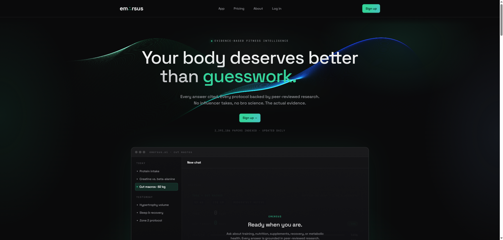

# Emersus AI

Evidence-based fitness and nutrition chat. pgvector semantic search over scientific literature, OpenAI synthesis, streamed answers with inline interactive widgets and source-grounded citations.



## Status

**Archived.** Built solo from late February to late April 2026 (~6 weeks of focused work). The site (emersus.ai) has been wound down. This repo is published as a portfolio artifact, not a maintained product.

I'm sharing it because the parts I'm proudest of are the engineering decisions you can only see by reading code and design docs together: the retrieval evaluation, the grounding subsystem, the widget pipeline, and the postmortems of approaches that didn't work.

## Stack at a glance

- React 18 (via esm.sh, no local bundler) + Express 5 + self-hosted Supabase (Postgres 15 + pgvector) + OpenAI + Resend
- Single Hetzner box (Ryzen 9 + 128 GB ECC), Docker, Caddy, no Vercel, no managed Supabase
- ~1,300 commits, ~55 design docs and plans tracked in `docs/superpowers/`

## Highlights for a reviewer

If you only have ten minutes, these are the most signal-dense pieces.

### Retrieval

- [`scripts/eval/results/anchor-bench-z2-live-200-grading.md`](scripts/eval/results/anchor-bench-z2-live-200-grading.md) — graded results for the production retrieval stack, on a 200-fixture stratified set.
- 10-stack rerank shootout. Paired Wilcoxon at Bonferroni α=0.0056, with the `Z2` configuration (HyDE query expansion + Zerank-2 rerank) shipping at +10pp recall@10 over the dense baseline (p=0.005). Notably: HyDE and BM25 turn out to be redundant in this corpus; adding BM25 to a HyDE+rerank stack regressed recall.
- The eval harness itself: [`scripts/eval/bench-matrix.js`](scripts/eval/bench-matrix.js) and [`scripts/eval/fixtures/retrieval-v2.json`](scripts/eval/fixtures/retrieval-v2.json). Stratified across difficulty, format, population, and length.
- Match RPC: `match_evidence_chunks_v4` substitutes title-only matches with passage hits from the same DOI. Spec: [`docs/superpowers/specs/2026-04-22-evidence-retrieval-source-centric-design.md`](docs/superpowers/specs/2026-04-22-evidence-retrieval-source-centric-design.md).

### Grounding

- [`docs/superpowers/specs/2026-04-23-evidence-grounding-enforcement-design.md`](docs/superpowers/specs/2026-04-23-evidence-grounding-enforcement-design.md). Inline `citesrcN` citation markers, a citation-mode verifier, a `GroundingBadge` UI, and five separate assessment paths (fidelity, paraphrase, adversarial, source-swap canary, production shadow sampling).
- [`docs/superpowers/specs/2026-04-26-anchor-verified-citations-design.md`](docs/superpowers/specs/2026-04-26-anchor-verified-citations-design.md) extends this to anchor-verified citations.

### Widget pipeline

- [`docs/superpowers/specs/2026-04-17-widget-template-refactor-design.md`](docs/superpowers/specs/2026-04-17-widget-template-refactor-design.md). 55 widget templates, all on OpenAI strict-mode tool schemas with the "superset data" pattern so one tool schema can serve multiple template types without losing strictness.
- The harness for regressing schema changes: [`scripts/widget-diagnose/`](scripts/widget-diagnose). 100-prompt bench, pipeline-realistic runner, gpt-5.4 LLM judge across 5 rubrics, Playwright gallery.
- Calculator widgets compute derived values (BMR, TDEE, 1RM, body fat, macro splits) server-side from atomic inputs the model supplies. The model never authors arithmetic.

### Failure postmortem

- [`memory`](docs/superpowers/) is full of decisions that worked. [Mode-2 Qualifier-Preservation Verifier (MQPV)](docs/superpowers/specs/2026-04-26-mode2-qualifier-preservation-design.md) is one that didn't. Built, benched (200-chat run), reverted on data: 21% reduction in mode_2 errors at 13s p50 latency, against a target of 70-80% at 6-8s. The bench surfaced a useful priority list for a different approach, so the work wasn't wasted, but the approach was wrong.

### Infra

- [`docs/superpowers/plans/2026-04-25-hetzner-cloud-to-robot-migration.md`](docs/superpowers/plans/2026-04-25-hetzner-cloud-to-robot-migration.md). End-to-end runbook for migrating a live production database (Postgres 15 + pgvector + HNSW indices preserved) from a Hetzner Cloud box to a Robot dedicated box, via vSwitch streaming replication. 14-minute downtime, no index rebuild.

### Mobile + cross-browser audit

- [`docs/superpowers/specs/2026-04-23-mobile-browser-audit-design.md`](docs/superpowers/specs/2026-04-23-mobile-browser-audit-design.md). Headed Playwright harness ([`scripts/perf/landing-audit.mjs`](scripts/perf/landing-audit.mjs)) that runs CSP, console-error, FPS-under-CPU-throttle, viewport, and tap-target checks against every page in three profiles.

## Repo map

```
api/                   Express handlers (mounted by server.js)
  emersus/workflow.js  Thin chat orchestrator (~90 lines)
  emersus/pipeline/    The real chat engine: sanitize → safety →
                       retrieve → synthesize → stream
shared/                Isomorphic JS used by server + client
  react-chat-app.js    Main chat UI
  emersus-renderer.js  Parses widget + workout fences from LLM output
scripts/               Data ingestion, embedding, eval, perf
  eval/                Retrieval bench + fixtures + result files
  widget-diagnose/     Widget regression harness
  perf/                Mobile + landing audit harness
supabase/              SQL migrations
docs/superpowers/      Spec + plan docs, written before code
auth/, app/, chat/     Static HTML entry points
server.js              Express entry, both local and prod
```

## What's not in this repo

- `infra/`. The self-hosted Docker stack (docker-compose, Caddy config, JWT secret generator, Postgres tuning) is gitignored except for a placeholder template at `infra/.env.template`. The repo cannot stand up the production stack on its own.
- The corpus itself. ~1.1M scientific paper records were ingested via OpenAlex bulk-download and PubMed/biorxiv enrichment scripts. The data lives in Supabase, not in the repo.
- API keys. Every secret reads from `.env`; only `.env.example` (placeholder values) is tracked.

## Caveats

- Some of the design docs reference concrete production numbers (latencies, dollar costs, recall lifts). Those are real numbers from this codebase running against the production corpus during the relevant week, not benchmarks I can rerun for you. Methodology and code are reproducible; specific numbers are not.
- Local dev points at the production Supabase. There is no dev DB. This was a deliberate trade for solo speed and is documented as such in `CLAUDE.md`. It's not what I would do at any larger scale.
- The repo is large (~500 MB packed). Early commits included scraped PubMed XML; that data was later deleted from the working tree but still lives in pack files.

## Contact

`info@emersus.ai`
